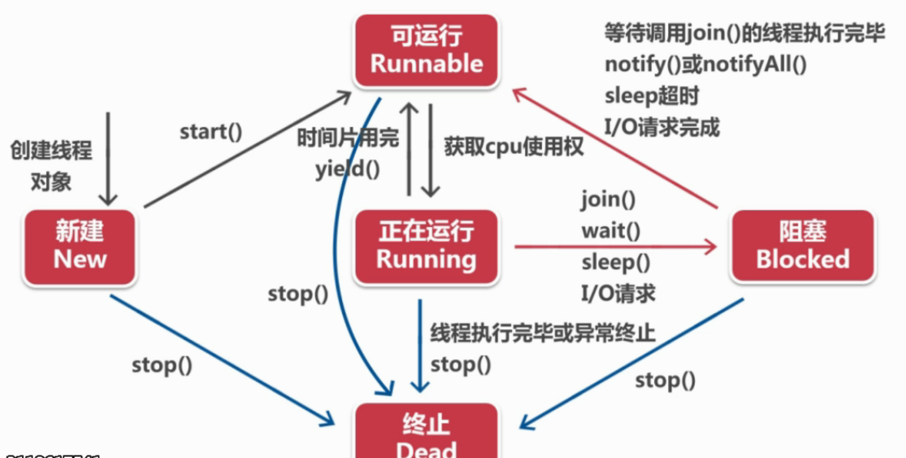

# Java线程

## 什么是多线程
我们同时打开浏览器/音乐/idea，每一个都是一个进程，进程是由线程组成的。  
多线程的意义：让操作系统能多任务进行操作。充分利用cpu资源。  


## 线程的创建
有两种创建线程的方式。  
两种方法的区别及场景：  
1.因为java不支持多继承，子类还需要继承其他父类，不能只继承Thread类时，就需要实现Runnable接口了。  
2.不打算重写Thread类的其它方法（继承意味着要重写父类所有方法）  
3.实际上，实现Runnable的方法更常用。  
### 创建一个Thread类,或者一个Thread子类的对象

```bash
// 自定义一个线程类
class MyThread1 extends Thread{

    // 构造方法，调用父类的名字
    public MyThread1(String name){
        super(name);
    }

    @Override
    public void run() {
        for (int i = 0;i<10;i++){
            System.out.println(getName()+"正在运行"+i);
        }
    }
}


public class ThreadTest1 {
    public static void main(String[] args) {

        System.out.println("主线程1");
        MyThread1 myThread1 = new MyThread1("子线程1");
        MyThread1 myThread2 = new MyThread1("子线程2");

        myThread1.start();
        myThread2.start();


        System.out.println("主线程2");
    }
}
```

第一个运行的是主进程1，其它两个进程和主进程齐头并进，什么时候获取CPU资源未知，故每次运行的结果都不相同。  

### 创建一个实现Runnable接口的类的对象
实现接口的方法不能直接调用Thread类的方法，需要采取一些曲线救国的方法。  
比如获取线程名和启动线程。  

```bash

class PrintRunnable implements Runnable{
    @Override
    public void run() {
        // 只能调用Thread类的静态方法
        System.out.println(Thread.currentThread().getName()+"正在运行");
    }
}

public class RunnableTest {
    public static void main(String[] args) {
        // 启动线程三步
        // 1.新建自定义线程类对象
        PrintRunnable printRunnable1 = new PrintRunnable();
        
        // 2.将自定义线程类对象作为参数，新建Tread线程对象
        Thread thread1 = new Thread(printRunnable1);
     
        // 3.通过Thread类的start方法启动线程
        thread1.start();
      
    }
}

```

## 线程的状态和生命周期
  
当执行start方法时，说明线程已进入可运行阶段，等待获得cpu使用权，  
当cpu开始执行该线程时，说明该线程进入运行阶段。  

### 运行到阻塞的方法--sleep()
sleep的使用场景：  
1.线程执行过快----放慢执行速度，用于计时。  
2.每次线程执行刷新结果相同，可以让线程隔一段时间执行刷新一次，避免资源浪费。  
另外，休眠时间为1000ms，再运行时有一个等待执行的时间，所以线程实际终止的时间超过1000ms，在写时钟类程序时，会发现时间越跑越慢了。

### 运行到阻塞的方法--join()
join抢占执行，调用join的线程优先执行，执行结束后，其他线程才可以执行。  

## 线程优先级
sleep和join方法都是操作获得cpu使用权，通过手动设置方法，有没有更简便的方法，让某些线程优先执行呢？  

1.Java为线程类提供了10个优先级，优先级可以用整数1-10表示,超过范围会抛出异常，主线程默认优先级为5  

2.三个优先级常量代表1,5,10

3.虽然设置了优先级，但由于机器的不同，进程的执行结果仍然具有随机性，不能完全保证优先级高的一定优先执行。  

4.尤其是在循环次数很少的情况下，优先级的影响力 < 启动顺序.  

## 互斥与通信
### 引入线程互斥的原因：  
各个线程是通过竞争CPU时间而获得运行机会的，各线程什么时候得到CPU时间,占用多久,是不可预测的，  
所以经常出现一个正在运行着的线程执行到一半就被迫暂停，另一个线程抢占到马上执行，这样两次操作数据，导致数据不对称。  
引入互斥后，一个线程在操作这个对象时，不允许其他线程对这个对象进行操作。  

线程同步：让线程**单独**使用CPU。  
线程通信：让线程**有序**使用CPU。  
