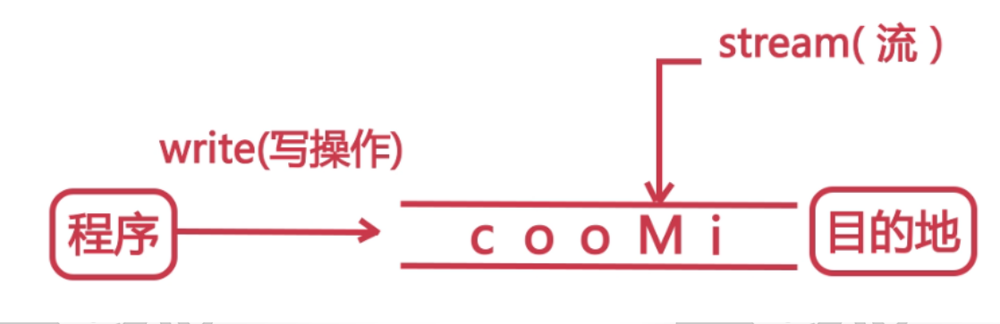
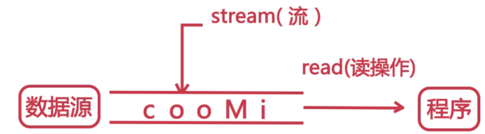
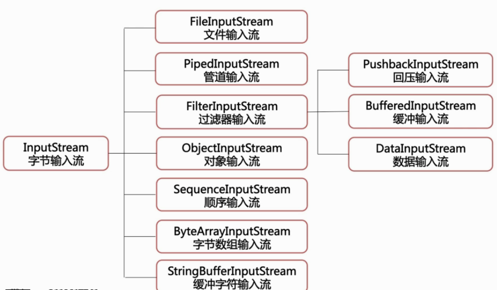
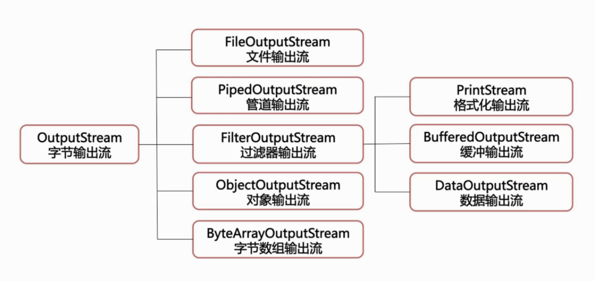
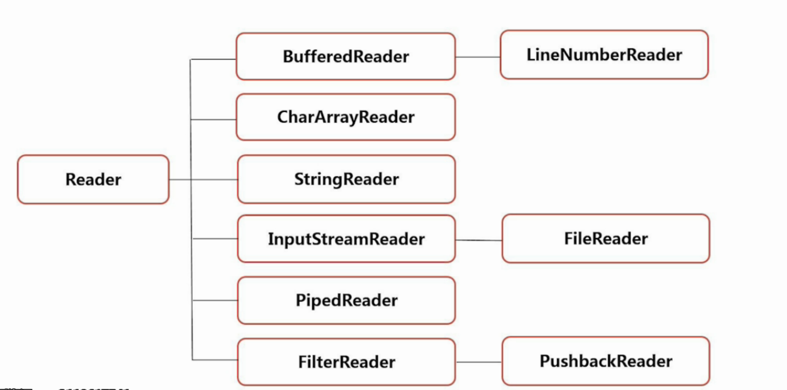
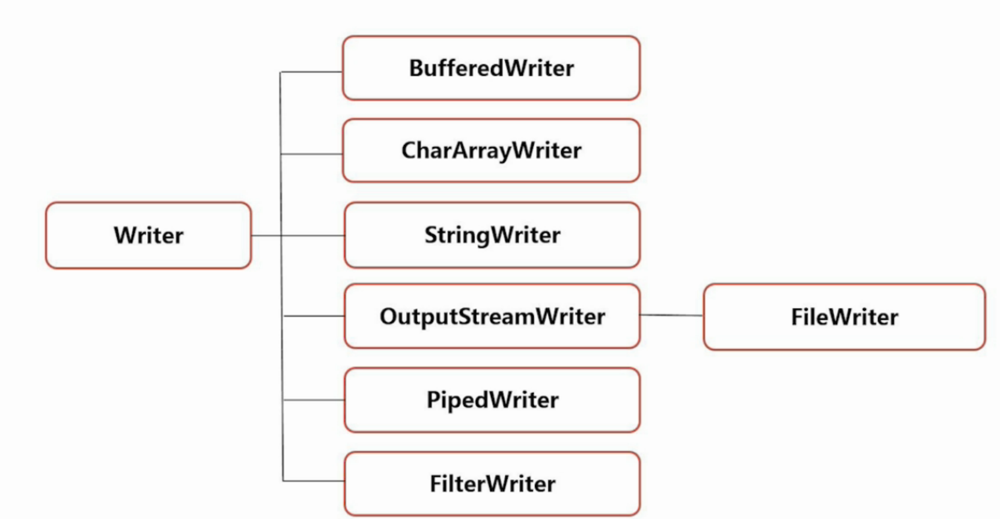

# Java输入/输出流
Java中是通过File类进行文件读写操作。
对字符操作采用字符流，对图像等二进制数据的操作采用字节流。
字节流不推荐使用字符操作，比如文件写入等，会因为编码问题导致写入内容乱码。
[字符在字节流中的乱码问题](https://github.com/EasterFan/JavaExercise/blob/master/FileProj/src/OutputStreamTest.java)

## 1.什么是输入输出流？
输出流--写：屏幕，文件
输入流--读：键盘，扫面仪，文件  
为节约JVM虚拟机资源，要求文件读写完成后，将输入输出流关闭。

### 输出流

### 输入流

## 2.字节流
字节流中主要介绍**文件输入输出流（FileInputStream）**和**缓冲输入输出流**
字节输入流的结构：

字节输出流的结构：

### 文件输入/出流FileInputStream
从文件系统中的某个文件中获得输入字节--比如复制粘贴等
用于读取诸如图像数据之类的原始字节流
read方法返回值为-1，说明文件读取到了最后一行。

[字节流应用---拷贝一张图](https://github.com/EasterFan/JavaExercise/blob/master/FileProj/src/CopyPic.java)

### 缓冲流
**缓冲流的目的：**
提高读写速度。文件读写是对硬盘进行读写操作的，缓存区在内存中，从内存中读写速度更快。

**输出流的flush方法：**
缓存的数据 = 缓存大小：自动执行write操作，将数据写入输出流。
缓存数据 < 缓存大小：文件没有被写入输出流，执行flush方法强制清空缓存区。  
[缓冲流案例](https://github.com/EasterFan/JavaExercise/blob/master/FileProj/src/BufferedOutputStream.java)  

## 3.字符流
字符流分为字符输入流和字符输出流  
字符输入流：  
  

字符输出流：  
  

为什么要将字节转为字符？  
因为网络中的数据都是二进制字节传输的，模拟网络传输来的数据，解析字节输入流。  
[流转换-将字节输入流读成字符](https://github.com/EasterFan/JavaExercise/blob/master/FileProj/src/ChangeByteToChar.java)  
[流转换-复制粘贴文本](https://github.com/EasterFan/JavaExercise/blob/master/FileProj/src/ChangeBytetoCharOutput.java)  

读输入流和写输出流时，编码要一致，否则中文乱码。

## 对象的序列化与反序列化
使用场景：我们发送聊天信息时，不可能一条信息，一条信息的发送聊天内容，发送时间，发送对象，ip地址等信息，我们都是将这些信息封装到一个类中，直接发送类的对象。  

如何发送对象内容，如何接收对象并解析呢？----对象序列化  

序列化：将java对象转为字节序列的过程--写入文件  
反序列化：将字节序列还原成java对象的过程---恢复对象  

### 对象序列化的步骤
1. 创建一个类，继承Serializable接口（实现该接口后，对象可读写） 
2. 创建对象
3. 将对象写入文件
4. 从文件读取对象信息

> 对象的读写涉及两个类：对象输入流（ObjectInputStream）和对象输出流（ObjectOutputStream）  

[对象序列化案例](https://github.com/EasterFan/JavaExercise/blob/master/FileProj/src/objectserial/GoodsSerialTest.java)
