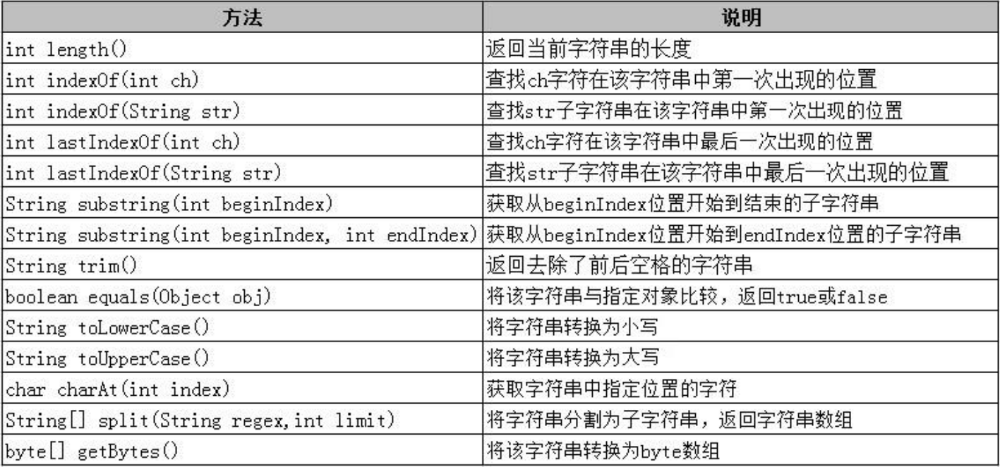

# java字符串

## 创建字符串String对象
三种方法：  

```bash
String s1 = "hello";
String s2 = new String();   // 创建一个空字符串对象
String s3 = new String("hello");
```
## 字符串常用方法
  

### 字符串和字节数组的相互转换

网络中传输字符串，是将字符串转为字节数组（二进制），接收后将字节数组还原成String。  

```bash
public class StringandBytes {
    public static void main(String args[]) throws UnsupportedEncodingException {

        String string = new String("JAVA 编程 基础");

        // 将字符串转为byte数组
        byte[] arrs = string.getBytes();
//        byte[] arrs = string.getBytes("GBK");
        for(int i=0;i<arrs.length;i++){
            System.out.print(arrs[i]);
        }
        
        // 将byte数组转为字符串
        String string2 = new String(arrs);
        System.out.println(string2);

        String string3 = new String(arrs,"GBK");
        System.out.println(string3);

    }
}

```


## String Builder
String 具有不可变性，StringBuilder可变。频繁操作字符时，推荐使用StringBuilder，避免产生大量中间变量，提高效率。  
StringBuilder和StringBuffer基本相似。  
StringBuffer是线程安全的，用在多线程中，StringBuilder是单线程中的，相比多线程速度更快。  
