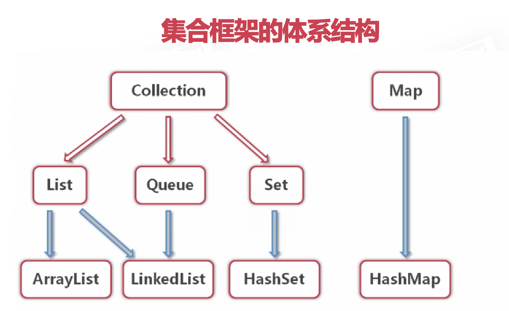

# Java集合

## 集合是什么
java中的集合是工具类（比如包装类），集合是一种容器，可以存储任意数量的具有共同属性的对象。可以存储String类，也可以存储自定义类。  
1. 为什么使用集合,而不用数组?  
数组存储的数据长度固定，集合长度可变  
2. 集合的使用场景  

```bash
无法预测存储数据的数量
同时存储具有一对一关系的数据(键值对)
需要进行数据的增删改查
数据重复问题
```

3. 集合的体系
  

list: 序列 Queue: 队列 set: 集  
list和Queue存放有序可重复的值，set存放无序不可重复的值，map存放不可重复的键值对 。  

## List列表
List可以精确的控制每个元素的插入位置,或删除某个位置的元素，非常方便。  
List的两个主要实现类是ArrayList和LinkedList  

### ArrayList

1. 动态增长,以满足应用程序的需求  
2. 在列表尾部插入或删除非常有效，更适合查找和更新元素  
3. ArrayList底层是由数组实现的，所以在ArrayList中部插入非常耗时，他适合在尾部操作，不适合在中部操作  
4. ArrayList中的元素可以为null  

[ArrayList中添加自定义类的Demo](https://github.com/EasterFan/JavaExercise/tree/master/CollectionProj/src)  

## Set集
set是元素无序并且不可以重复的集合，取出set集元素，可以迭代器，也可以用增强型for循环  

### HashSet

1. HashSet中的元素无序并且不可以重复  
2. HashSet中只允许一个null元素  
3. 具有良好的存取和查找性能  
4. HashSet的底层是HashMap  
5. hashset使用泛型消除安全隐患


### 迭代器
set集没有取数据的方法，可以用迭代器取出数据（先将set数据放到迭代器中）。  
Iterator接口可以以统一的方式对各种集合元素进行遍历  
hasNext()方法检测集合中是否还有下一个元素  
next()方法返回集合中的下一个元素  
注意：每使用一次迭代器，都要将向迭代器中赋值一次：`it = homeSet.iterator();`

```bash
// 先将set集放入迭代器中
Iterator it = homeSet.iterator();
        while (it.hasNext()){
            System.out.println(it.next());
        }
```

也可以使用for循环遍历set集  

```bash
  for(Map.Entry<String,String> entry:entrySet){
            System.out.println(entry.getKey()+"-"+entry.getValue());
}
```
### 在HashSet中存放自定义类

1. 打印该定义类对象时，打印出地址=====> 在该类中重写toString方法  
2. 可以向Set集中添加重复值，因为编译器无法比较自定义类是否相同======>在该类中重写hashCode和equals方法。  
hashCode和equals方法用来提高查询速度，hashCode用来判断在哪个桶里，equals用来判断是桶里的哪个元素。  

3. 自定义类是否相等的比较方法---equals逻辑

```bash

    @Override
    public boolean equals(Object obj) {
        // 判断两个对象是否相等，如果相等，返回true
        if(this == obj)
            return true;
        
        // 判断待判断的对象是否属于Pet_set类，如果属于，强转为Pet_set
        if(obj.getClass() == Pet_set.class){
            Pet_set pet_set = (Pet_set)obj;
            return pet_set.getName().equals(name) && pet_set.getAge()==age && pet_set.getSpecies().equals(species);
        }
           
        return false;
    }

```

### 在set中删除多个元素
删除set后，set的长度发生变化，后续遍历会报错，推荐的方法是：先将要删除的元素放到一个新的set集中，再从主set集中删除新set集。`set.removeall(set1)`  


## Map集合
Map中的数据是以键值对(key-value)的形式存储的，键值一一对应  
key-value以Entry类型的对象实例存在，Entry是Map的接口，Entry对象是无序排列的  
key值不可以重复，value值可以重复。  
允许null:null,即null值和null键的形式。  
Map的实现类是HashMap  

### 在Map中存储字符串对象
[Map存储String类--zoo字典](MapProj/src/MapZoo.java)  

### 在Map中存储自定义类对象
[Map存储自定义类--商品类](MapProj/src/MapGoodsTest.java)  


